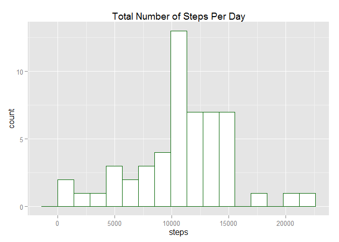
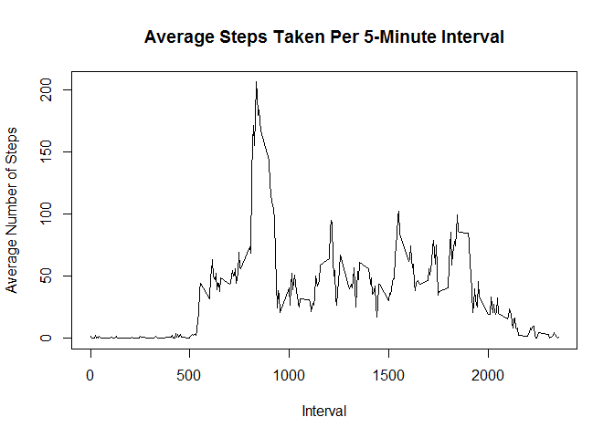
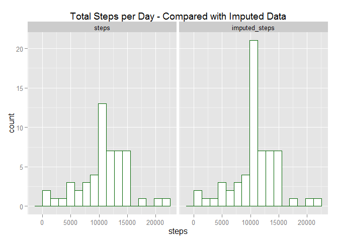
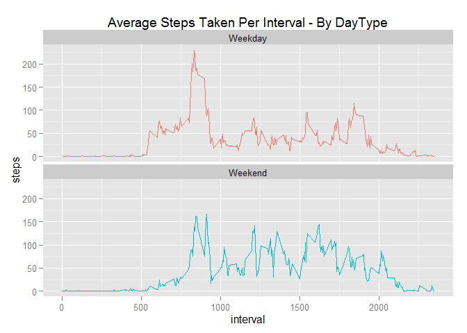

# Reproducible Research: Peer Assessment 1
Kevin Bitinsky  
February 19, 2015  


## Loading and preprocessing the data
Data Located at: https://d396qusza40orc.cloudfront.net/repdata%2Fdata%2Factivity.zip

Which is a zip file that contains the raw data in activity.csv

1. Load the data

```r
# Code included if data needs to be downloaded, but should be in the repo
#url <- "https://d396qusza40orc.cloudfront.net/repdata%2Fdata%2Factivity.zip"
#download.file(url, destfile = "./activity.zip", method = "curl")
unzip("activity.zip")
data <- read.csv("./activity.csv")
```
2. Process/ transform the data into a suitable format for analysis

```r
# change Factors to Date format
data$date <- as.Date(data$date, format = "%Y-%m-%d")
```


## What is mean total number of steps taken per day?

1. Total number of steps per day

```r
library(plyr)
library(ggplot2)
steps_per_day <- ddply(data, "date", summarize, steps = sum(steps))
```

2. Histogram of the total steps per day

```r
ggplot(steps_per_day, aes(x=steps)) + 
  geom_histogram(binwidth = max(steps_per_day$steps, na.rm = TRUE)/15, 
                 colour = "darkgreen", fill = "white") + 
  ggtitle("Total Number of Steps Per Day")
```

 

3. Calculate the mean and median of the total steps per day

```r
mean_spd <- round(mean(steps_per_day$steps, na.rm = TRUE), digits =2)
median_spd <- round(median(steps_per_day$steps, na.rm = TRUE), digits = 2)
```

**Mean total steps per day is:**

```r
# Unable to get knitr to suppress scientiic notation when call inline `r mean_spd`
print(mean_spd)
```

```
## [1] 10766.19
```

**Median total steps per day is:**

```r
print(median_spd)
```

```
## [1] 10765
```

## What is the average daily activity pattern?
1. A time series plot of the 5-minute interval (x-axis) and the average number of steps taken, averaged across all days (y-axis)


```r
steps_per_interval <- ddply(data, "interval", summarize, steps = mean(steps, na.rm = TRUE))
with(steps_per_interval,
     plot(interval, steps, type = "l",
          xlab = "Interval", ylab = "Average Number of Steps", main = "Average Steps Taken Per 5-Minute Interval")
     )
```

 

2. Which 5-minute interval, on average across all the days in the dataset, contains the maximum number of steps?

```r
max_steps = max(steps_per_interval$steps)
max_interval = steps_per_interval[steps_per_interval$steps == max_steps, 1]
sprintf("The maximum average number of steps per interval is: %f", max_steps)
```

```
## [1] "The maximum average number of steps per interval is: 206.169811"
```

```r
sprintf("And occurs at the interval: %i", max_interval)
```

```
## [1] "And occurs at the interval: 835"
```

## Imputing missing values

1. Calculate and report the total number of missing values in the dataset (i.e. the total number of rows with NAs)

```r
sprintf("the number of missing values: %i", length(which(is.na(data))))
```

```
## [1] "the number of missing values: 2304"
```

2. Devise a strategy to populate the missing values.

Assume that the average steps for interval with missing data will be a good representation.

3.  Fill in all of the missing values in the dataset.

```r
# Fill in missing values using the average for the interval
newdata <- data
missing <- which(is.na(newdata$steps))
newdata[missing,1] <- steps_per_interval[as.factor(newdata[missing,3]),2]
```

4. Repeat the above anaylsis, this time using the imputated data.
  + Total number of steps per day

```r
imp_steps_per_day <- ddply(newdata, "date", summarize, steps = sum(steps))
steps_per_day$imputed_steps <- imp_steps_per_day$steps
df <- melt(steps_per_day, id="date", measured = c("steps","imputed_steps"))
```

  + Histogram of the total steps per day

```r
ggplot(df,aes(x=value)) + 
  geom_histogram(binwidth = max(df$value, na.rm = TRUE)/15,
                 colour = "darkgreen", fill = "white") +
  facet_grid(.~variable) +
  xlab("steps") + 
  ggtitle("Total Steps per Day - Compared with Imputed Data")
```

 

  + Calculate the mean and median of the total steps per day

```r
imp_mean_spd <- round(mean(imp_steps_per_day$steps, na.rm = TRUE), digits = 2)
imp_median_spd <- round(median(imp_steps_per_day$steps, na.rm = TRUE), digits = 2)
```

**Mean total steps per day is:**

```r
print(imp_mean_spd)
```

```
## [1] 10766.19
```

**Median total steps per day:**

```r
print(imp_median_spd)
```

```
## [1] 10766.19
```

The median value has changed slighly by using imputed data.

## Are there differences in activity patterns between weekdays and weekends?

1. Update the imputed data with a new factor variable for "weekday" and "weekend" indicating whether a given date is a weekday or weekend day.

```r
daytype <- function(date) {
     if (weekdays(as.Date(date)) %in% c("Monday", "Tuesday", "Wednesday", "Thursday", "Friday")) 
        return("Weekday")
    else if (weekdays(as.Date(date)) %in% c("Saturday", "Sunday"))
        return("Weekend")
    else
        return("NA")
 }
newdata$daytype <- as.factor(sapply(newdata$date, daytype))
```

2. Display the average steps per interval comparing weekdays to weekends

```r
steps_per_interval_byW <- ddply(newdata, c("interval","daytype"), summarize, steps = mean(steps, na.rm = TRUE))

ggplot(data = steps_per_interval_byW,aes(x=interval, y=steps, group=daytype)) +
  geom_line(aes(color=daytype)) + facet_wrap(~ daytype, nrow = 2) + 
  ggtitle("Average Steps Taken Per Interval - By DayType") + 
  theme(legend.position="none")
```

 
