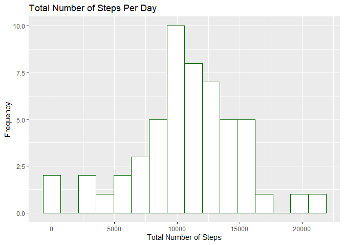
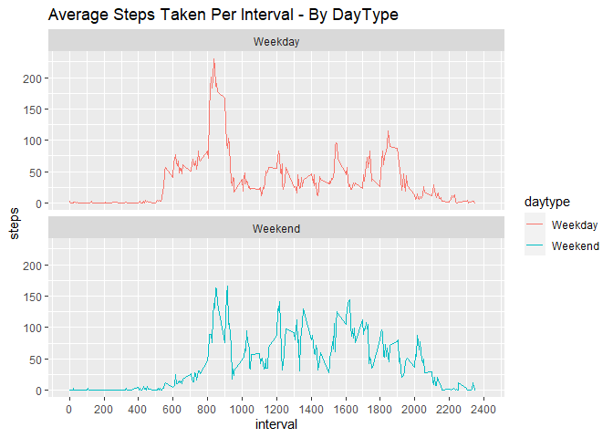

---
title: "Reproducible Research, Peer-graded Assignment: Course Project 1"
subtitle: "Activity Monitoring Device Analysis"
author: "Kevin Bitinsky"
date: "May 9, 2020"
output: 
  html_document:
    keep_md: true
    
---

## Introduction
This is an assignment in the Reproducible Research course of the Coursera / Johns Hopkins University Data Science Specialization Certificate. 

The intent of this report is to investigate data obtained from personal activity monitoring devices such as a Fitbit, Nike Fuelband, or Jawbone Up. Several questions will be answered and many steps in the data processing pipeline will be documented in this report. 

## Background
This assignment makes use of data from a personal activity monitoring device. This device collects data at 5 minute intervals through out the day. The data consists of two months of data from an anonymous individual collected during the months of October and November, 2012 and include the number of steps taken in 5 minute intervals each day.

The data for this assignment can be downloaded from the course web site:

Dataset: [Activity monitoring data](https://d396qusza40orc.cloudfront.net/repdata%2Fdata%2Factivity.zip)
The variables included in this dataset are:

* **steps**: Number of steps taking in a 5-minute interval (missing values are coded as NA)
* **date**: The date on which the measurement was taken in YYYY-MM-DD format
* **interval**: Identifier for the 5-minute interval in which measurement was taken

The dataset is stored in a comma-separated-value (CSV) file and there are a total of 17,568 observations in this dataset.

## Loading and preprocessing the data


```r
# get required packages
if (!require("dplyr")) {
install.packages("dplyr")
}
if (!require("ggplot2")) {
install.packages("ggplot2")
}
library(dplyr)
library(ggplot2)

options(scipen=999) # force non-scientific notation
```

The data is located at: https://d396qusza40orc.cloudfront.net/repdata%2Fdata%2Factivity.zip This is a zip file that contains the raw data in activity.csv

### 1. Load the data

```r
url <- "https://d396qusza40orc.cloudfront.net/repdata%2Fdata%2Factivity.zip"

ifelse(!dir.exists(file.path("data")), dir.create(file.path("data")), "Folder already exists")
```

```
## [1] "Folder already exists"
```

```r
destfile <- "./data/Dataset.zip" 
 
if (!file.exists(destfile)) {
  download.file(url ,destfile,method="auto") 
  unzip(destfile,exdir="./data")
}

data <- read.csv("./data/activity.csv")
```

Confirm that there are a total of 17,568 observations in this dataset (as is expected from the above description).

```r
dim(data)
```

```
## [1] 17568     3
```

### 2. Process/ transform the data into a suitable format for analysis
The date field is currently of a _Factor_ type which should be converted to _Date_.

```r
str(data)
```

```
## 'data.frame':	17568 obs. of  3 variables:
##  $ steps   : int  NA NA NA NA NA NA NA NA NA NA ...
##  $ date    : Factor w/ 61 levels "2012-10-01","2012-10-02",..: 1 1 1 1 1 1 1 1 1 1 ...
##  $ interval: int  0 5 10 15 20 25 30 35 40 45 ...
```

```r
data$date <- as.Date(data$date, format = "%Y-%m-%d")
```


## What is mean total number of steps taken per day?
(For this part of the assignment, you can ignore the missing values in the dataset.)

### 1. Total number of steps per day

```r
steps_per_day <- data %>% 
          group_by(date) %>% 
          summarize(steps = sum(steps))
```

### 2. Histogram of the total steps per day

```r
ggplot(steps_per_day, aes(x=steps)) + 
  geom_histogram(binwidth = max(steps_per_day$steps, na.rm = TRUE)/15, 
                 colour = "darkgreen", fill = "white") + 
  ggtitle("Total Number of Steps Per Day") +
  xlab("Total Number of Steps") +
  ylab("Frequency")
```

```
## Warning: Removed 8 rows containing non-finite values (stat_bin).
```

<!-- -->

### 3. Calculate the mean and median of the total steps per day

```r
mean_spd <- round(mean(steps_per_day$steps, na.rm = TRUE), digits =2)
print(mean_spd)
```

```
## [1] 10766.19
```

```r
median_spd <- round(median(steps_per_day$steps, na.rm = TRUE), digits = 2)
print(median_spd)
```

```
## [1] 10765
```

**Mean total steps per day is:** 10766.19

**Median total steps per day is:** 10765


## What is the average daily activity pattern?
### 1. Create a time series plot of the 5-minute interval (x-axis) and the average number of steps taken, averaged across all days (y-axis)


```r
steps_per_interval <- data %>% 
          group_by(interval) %>% 
          summarize(steps = mean(steps, na.rm = TRUE))

ggplot(steps_per_interval, aes(x = interval, y = steps)) + 
  geom_line(colour = "darkgreen") +
  ggtitle("Average Steps Taken Per 5-Minute Interval") +
  xlab("Interval") + 
  ylab("Average Number of Steps") +
  scale_x_continuous(limits = c(0, 2400), 
                     breaks = seq(0,2400,200))
```

<!-- -->

### 2. Which 5-minute interval, on average across all the days in the dataset, contains the maximum number of steps?

```r
max_steps = max(steps_per_interval$steps)
print(max_steps)
```

```
## [1] 206.1698
```

```r
max_interval = steps_per_interval[steps_per_interval$steps == max_steps, 1]
print(max_interval)
```

```
## # A tibble: 1 x 1
##   interval
##      <int>
## 1      835
```

**The maximum average number of steps per interval is:** 206.1698113
**And occurs at the interval:** 835

## Imputing missing values
There are a number of days/intervals where there are missing values coded as NA. The presence of missing days may introduce bias into some calculations or summaries of the data.

### 1. Calculate and report the total number of missing values in the dataset (i.e. the total number of rows with NAs)

```r
sprintf("the number of missing values: %i", length(which(is.na(data))))
```

```
## [1] "the number of missing values: 2304"
```

### 2. Devise a strategy to populate the missing values.

Use mean imputation by assuming that the average steps by interval will be a reasonable approximation for any interval that contains missing data.

### 3. Create a new dataset filling in all of the missing values, using the imputation strategy.

```r
# Fill in missing values using the average for the interval

newdata <- data

for (i in 1:nrow(newdata)) {
    if(is.na(newdata$steps[i])) {
        newdata$steps[i] <- 
          steps_per_interval$steps[which(steps_per_interval$interval == data$interval[i])]
    }
}
```

### 4. Using the imputed dataset, make a histogram of the total number of steps taken each day. Calculate and report the mean and median total number of steps taken per day. Do these values differ from the estimates from the first part of the assignment? What is the impact of imputing missing data on the estimates of the total daily number of steps?


```r
imp_steps_per_day <- newdata %>% 
          group_by(date) %>% 
          summarize(steps = sum(steps))
```


```r
ggplot(imp_steps_per_day, aes(x=steps)) + 
  geom_histogram(binwidth = max(imp_steps_per_day$steps, na.rm = TRUE)/15, 
                 colour = "darkgreen", fill = "white") + 
  ggtitle("Total Number of Steps Per Day - Imputed Data") +
  xlab("Total Number of Steps") +
  ylab("Frequency")
```

<!-- -->

  Calculate the mean and median of the total steps per day

```r
imp_mean_spd <- round(mean(imp_steps_per_day$steps), digits = 2)
print(imp_mean_spd)
```

```
## [1] 10766.19
```

```r
imp_median_spd <- round(median(imp_steps_per_day$steps), digits = 2)
print(imp_median_spd)
```

```
## [1] 10766.19
```
**Mean total steps per day is:** 10766.19

**Median total steps per day is:** 10766.19


The median value has changed slighly by using imputed data.

## Are there differences in activity patterns between weekdays and weekends?

### 1. Update the imputed data with a new factor variable for "weekday" and "weekend" indicating whether a given date is a weekday or weekend day.

```r
daytype <- function(date) {
     if (weekdays(as.Date(date)) %in% c("Monday", "Tuesday", "Wednesday", "Thursday", "Friday"))
        return("Weekday")
    else if (weekdays(as.Date(date)) %in% c("Saturday", "Sunday"))
        return("Weekend")
    else
        return("NA")
 }
newdata$daytype <- as.factor(sapply(newdata$date, daytype))
```

### 2. Display the average steps per interval comparing weekdays to weekends

```r
newdata %>% 
  group_by(interval, daytype) %>% 
  summarize(steps = mean(steps)) %>%
  ggplot(aes(x=interval, y=steps, group=daytype)) +
  geom_line(aes(colour = daytype)) + 
  facet_wrap(~ daytype, nrow = 2) +
  ggtitle("Average Steps Taken Per Interval - By DayType") +
  scale_x_continuous(limits = c(0, 2400), 
                     breaks = seq(0,2400,200))
```

<!-- -->
